<div align="center">


<p>
  
  <a href="https://github.com/dejay-vu"></a>
</p>

</div>

## 🖥️ `$ ssh dejayvu@oxford`

```console
Welcome to Junhao's brain — gpu-node-01 (GNU/Linux 6.6 x86_64)

  * Education   DPhil in Engineering Science, University of Oxford
  * Previously  Machine Learning Software Engineer @ AMD
  * Focus       GPU kernels · ML systems · high-performance computing
  * Stack       C++ · Python · CUDA · HIP · PyTorch

Last login: today, probably still compiling
```

## ⚡ `$ dejayvu-smi`

<!-- rendered daily from WakaTime by scripts/dejayvu_smi.py -->
<!--START_SECTION:waka-->

```text
Sat Jul 18 16:16:29 2026
+-----------------------------------------------------------------------------------------+
| DEJAYVU-SMI 5.0.0          Driver Version: DPhil@Oxford      CUDA Version: 12.8         |
|-----------------------------------------+------------------------+----------------------|
| GPU  Name                 Persistence-M | Bus-Id          Disp.A | Volatile Uncorr. ECC |
| Fan  Temp   Perf          Pwr:Usage/Cap |           Memory-Usage | GPU-Util  Compute M. |
|=========================================+========================+======================|
|   0  Junhao Zhang                   On  |     0000:OX:FD.0   On  |                 N/A  |
| 42%  36C    P0              65W / 300W  |    2537MiB / 8760MiB   |      98%  Exclusive  |
+-----------------------------------------+------------------------+----------------------+

+-----------------------------------------------------------------------------------------+
| Processes (all-time coding activity, via WakaTime):                                     |
|  GPU   PID  Type  Process name        Util                         Time                 |
|=========================================================================================|
|    0     1  C+G   Python             █████████████▋░░░░░░░░░░░   54.8 %   1522 h 26 m   |
|    0     2  C+G   TypeScript         ████░░░░░░░░░░░░░░░░░░░░░   16.2 %    450 h 55 m   |
|    0     3  C     Other              ██▏░░░░░░░░░░░░░░░░░░░░░░    8.7 %    241 h  6 m   |
|    0     4  C     JSON               █▏░░░░░░░░░░░░░░░░░░░░░░░    4.7 %    129 h 55 m   |
|    0     5  C     Markdown           █▏░░░░░░░░░░░░░░░░░░░░░░░    4.7 %    129 h 13 m   |
|    0     6  C     Bash               ▋░░░░░░░░░░░░░░░░░░░░░░░░    2.9 %     80 h 50 m   |
|    0     7  C+G   C++                ▌░░░░░░░░░░░░░░░░░░░░░░░░    2.4 %     65 h 12 m   |
+-----------------------------------------------------------------------------------------+
```

<!--END_SECTION:waka-->

<div align="center">
<sub>live data via <a href="https://wakatime.com/@018b75d5-bdbf-4b28-954d-7c590ade7f91">WakaTime</a> · rendered daily by <a href="scripts/dejayvu_smi.py"><code>dejayvu_smi.py</code></a></sub>
</div>

## 📈 `$ jaytop`

<div align="center">



<sub>data via GitHub GraphQL · rendered daily by <a href="scripts/jaytop_panel.py"><code>jaytop_panel.py</code></a></sub>

</div>

## 🧰 `$ ls ~/toolchain`

<div align="center">

**Systems & ML**


<p>
  
  
</p>

**Web & Data**


**Infra & Tools**


</div>

## 📟 `$ metrics`

<div align="center">


</div>

## 🏙️ `$ render --contributions --3d`

<div align="center">

<picture>
  <source media="(prefers-color-scheme: dark)" srcset="https://raw.githubusercontent.com/dejay-vu/dejay-vu/main/profile-3d-contrib/profile-night-rainbow.svg" />
  
</picture>

</div>

## 🐍 `$ ./snake --feed contributions`

<div align="center">

<picture>
  <source media="(prefers-color-scheme: dark)" srcset="https://raw.githubusercontent.com/dejay-vu/dejay-vu/output/github-contribution-grid-snake-dark.svg" />
  
</picture>

</div>

## 📫 `$ ping dejayvu`

<div align="center">

<p>
  <a href="mailto:junhao.zhang2301@gmail.com"></a>&nbsp;
  <a href="https://www.linkedin.com/in/junhao-zh/"></a>&nbsp;
  <a href="https://www.instagram.com/dejayyvu/"></a>
</p>


</div>
